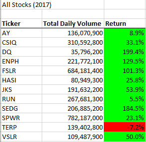
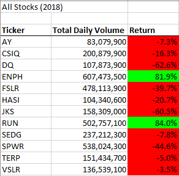
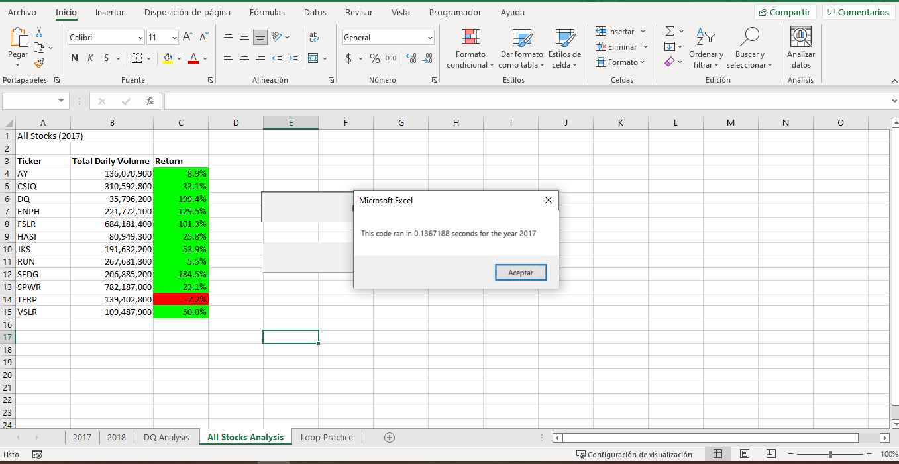
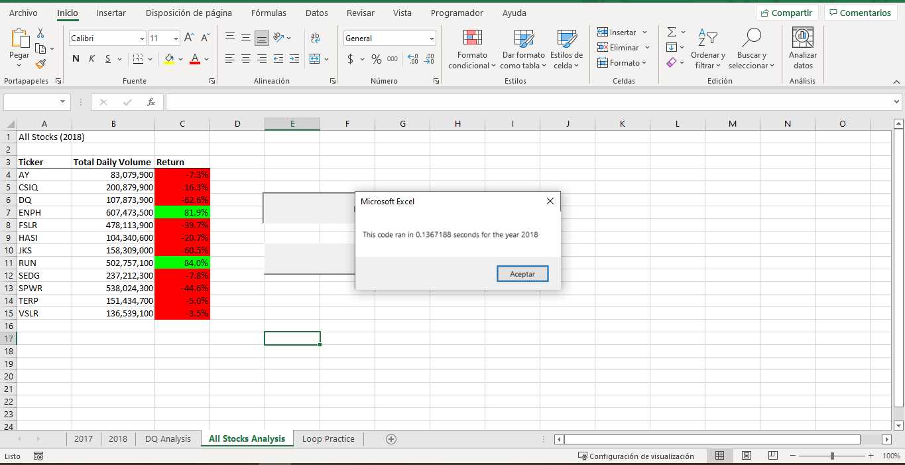

# Stock-analysis

## Overview of Project
In this week challenge, we were given a significant ammount of data regarding wall street stocks. We are trying to help our friend steve. Steve was helping his parents invest in stocks, his parents were really excited in green energy, so they decided to invest in companies that were related to green energy. Steve was a bit concern with their performance, but analysing the data manually seemed a bit uneficient. We decided to help him and run analysis on the stock performances to present them and identify them in a more simple way. 

Steve is looking to analyse all the stocks availabe, and create a more complete research for his parents. This of course presents a problem to the macro we have developed. While it does work and completes every action required, the run-time is pretty uneficient. So, using the macro as it is with a larger dataset might take it more time to complete all the task. For this we are charged with refactoring the code in order to make more efficient and run in less time. 

For this project we used and learned VBA (Visual Basic for Applications). With the help of this tool, we were able to automatize the analysis and calculus needed to analyze each stock. Not only that, but we also made sure to refactore the code and garantee a more efficient solution, capable of being used in larger datasets containing more than 12 stocks.

## Results

### Stock Performance
To identify a stock performance we are going to calculate the return. For this we needed to identify the first and last closing price the stock had in that year. Fortunatly for us, the dataset was organized by ticker and by date. This made the work of finding the firs and last price easier, because we only needed to look up the first time the ticker appeared and the last time it did, to then compare each closing price. To do this, we created 2 *If-Conditionals*. 

Now that we had all the numbers needed to calculate the return, we needed to made the calculations. The formula to get the return was *Return=(ClosingPrince/StartingPrice)-1*

In 2017, most of the stocks performed pretty well. Most of them have positive returns, and some even manage to almost triplicate their value, like SEDG or DQ with a return of 184.5% and 199.4%.

This seemed great and like an obvious investment opportunity. We can now understand why steve parents invested in DQ stocks, with their 199.4% return. Sadly, the year 2018 was not very friendly for them. Most of the stocks gave negative returns. Only two out of the twelve stocks had a positive return.

Seeing how the stocks perfomed, it is not a surprise that steve wanted to do a broader research and investigate more options. Although this decrease might be due to certain news regarding green energies or anomalies, it is better to start seeing other options. We need to expand the data set to include more stocks and see how well are other stocks performing and identify those that are worth investing. In order to scale up the dataset, we need to refactor our code and make sure it runs more efficiently. 

### Code Performance

The original code worked correctly. It completed all the tasks and formated the sheet just as we wanted, but something seemed odd. If we ran the code and saw how it was working on the sheet, we could see how all the cells were being filled one by one. This action took some time, and made the code ran slower. 

**Original Run Time for the Year 2017**

**Original Run Time for the Year 2018**

It certainly would be faster if the code just inputs it all together. In order to make this we refactored the code to hold each value in a variable, instead of resetting their values everytime we jumped to another ticker. This made the code run faster, compared to the original format.

**Refactored Run Time for the Year 2017**

**Refactored Run Time for the Year 2018**

### Refactoring Process
The first change we needed make to our code were the variables. In the original code, the variables that contained the volume, initial price and closing price of a stock were individual variables. 
> Dim startingPrice As Double

> Dim closingPrice As Double

> totalVolume=0 (We needed to include this line of code, inside the for loop to reseat it everytime we jumped to another ticker)

This created the need to output the value as soon as we got them, because we were constantly overwriting its value everytime we skipped to another ticker. To solve this problem we created the variable as arrays that could hold 12 values (this number can be change to match the ammount of stocks being analyze). 
> Dim tickerVolume(11) As Double

> Dim tickerstartingPrice(11) As Double

> Dim tickerclosingPrice(11) As Double

Having the variables as arrays made it easier to store each individual value in a specific variable. Another benefit of this is that, now that we have each value with its own variable, we could expand our code to include individual analysis of specefic stocks. We can store the value and use it later, instead of being output and erased afterwards.

We also needed to change our *for-loop* because we no longer needed to immediatly input our values. The original *for-loop* looked a bit like this: 

We could now take out the input instructions of the loop, but we needed to create another for loop to output the values. The refactored *for-loop* with the aditional loop looks like this:

## Summary

### Pros and Cons of Refacturing

The obvious advantage of refacturing code is that we make it more efficient and create a more pleasent experience for the end user. It also give us the opportunity to expand our code in the future and make wonderful new things. The dssadvantage is that it requires to fully understand the logic of the code, to simply start thinking how to improve it. I can see how a poorly documented code can be very complicated to refactore. Another disadvantage is that it might breake other parts of the code. If we are not carefull, and not make sure that the changes we made match the code, we might spend a lot of more time debugging.

### Pros and Cons of Refacturing the VBA script

The advantage of refacturing the original VBA script was that it made the code run smoother. It did not looked nice seeing all the cells being filled one by one to then be changed to the propper format. It ceartinly looks cleaner now that we click the button and the whole table is filled and formated instanly. The only disadvantage that I saw was that if we were not careful, it could have perfomed the same. If we did not understand that we needed to create an aditional *for-loop* to outpoot the results, the code would have run the same as before. 
